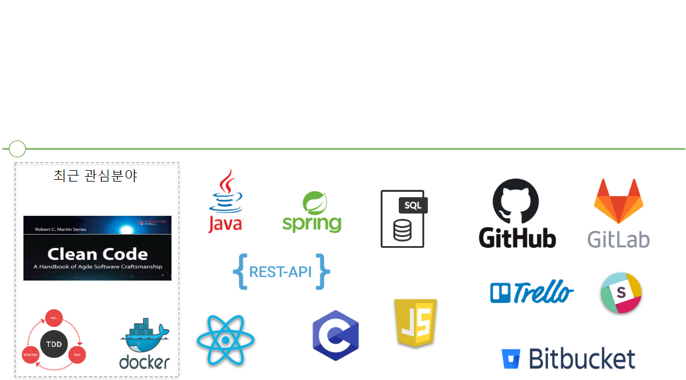

## 송승효

* Email: tmdgy15@gmail.com
* My Introduce: https://songseunghyo1.github.io/
* GitHub: https://github.com/Songseunghyo1  

 

## SKILLS 

* **Language**
  * Java(Main)
  * C
  * C# (경험있음)
  * C++ (경험있음)
* **Frameworks**
  * Spring Framework
* **Database**
  * MySQL, MariaDB
* **Tools**
  * GitHub, GitLab, Bitbucket
  * Trello
  * Slack
* **Etc**
    * Linux
 

## PROJECT [Detail](#projectdetail)

* **제대로 통한다 관리자페이지** 

  * **주요기능**
    * 제주대학교에서 출발하는 시내버스와 셔틀버스의 시간표를 실시간 제공
    * 비인가자 접근 방지를 위한 로그인기능
    * 데이터베이스 명령문을 모르는 사람도 데이터를 변경 가능하도록 수정(개발중)
  * **개발기간** 
    *  2018.03 ~ 2018.06
  * **개발환경**
    * Linux
    * InteliJ
  * **사용언어 및 기술**
    * Java
    * Spring Framework, Spring Security
    * Thymeleaf
  * Database
    * MariaDB  

   

## LAB [Detail](#projectdetail)

#### 산학연 연계 프로젝트

* **Bluetooth Router**
  * 주요기능
    * 블루투스 통신을 이용하여 가정에서 기르는 반려동물의 활동량 증가
    * 중계기와 반려동물의 목걸이간의 통신을 통해 활동량 체크
  * 개발기간
    * 2017.09 ~ 2019.02
  * 개발환경
    * Win10
    * Android Studio
  * 사용언어 및 기술
    * Android
    * Android BLE  

 

* **Ticket Solution** 
  * 주요기능
    * 하나의 앱으로 여러 온라인 쇼핑몰의 상품상태 확인(재고, 판매수량 등)
  * 개발기간
    * 2017.07 ~ 2018.06
  * 개발환경
    * Win10
    * Webstorm
  * 사용언어 및 기술
    * React Native
    * React Navigation  

 

* **Smart Pad**
  * 주요기능
    * 하드웨어 장비위에 반려동물이 앉을 경우 체온, 심탄도 등을 측정하여 서버에 저장
    * 사용자의 요청에따라 어떠한 요청인지 파싱하여 서버에 저장된 데이터 제공
  * 개발기간
    * 2017.03 ~ 2019.02
  * 개발환경
    * Win10
    * Visual Studio
  * 사용언어 및 기술
    * C  

 

## My Interests

## <a id="projectdetail">Project Detail

**제대로 통한다**

현재 제주도는 대중교통 활성화를 위해 버스전용차로를 만들고 버스시스템이 크게 개편되었습니다. 그리고 플레이스토어 혹은 앱 스토어에 출시된 어플리케이션은 기사님이 어플리케이션을 실행시키지 않으면 정보를 얻을 수 없습니다. 그래서 이 불편함을 해소하고자 '직접 만들자!'라는 생각에 시작한 프로젝트입니다. 그리고 제주대학교는 캠퍼스가 넓어 교내에서 순환버스를 운행하는데, 이 순환버스를 이용하는 학우가 많습니다.  이 애플리케이션을 사용중인 사용자에게 시내버스와 아울러 교내순환버스의 도착정보를 함께 제공하여 편의를 제공하기 위해 제작하였습니다.

저는 이 프로젝트를 진행하며 관리자페이지 제작을 맡았습니다. 관리자 페이지를 제작하게 된 동기는 평일과 공휴일 그리고 방학 중 모두 버스노선과 도착정보가 상이하고, 새로 바뀔 수 있는 버스 노선 정보를 데이터베이스의 명령문을 알지 못하는 사람도 변경할 수 있도록 하기 위함입니다. 

관리자 페이지를 만들며 Spring Security를 사용하여 로그인 기능과 함께 세션을 유지할 수 있도록 개발하였고, Thymeleaf를 이용하여 데이터베이스로부터 정보를 가져와 웹 페이지에 출력하였습니다.

**Bluetooth Router**

이 프로젝트는 비콘과 블루투스 라우터(중계기), 반려동물의 목걸이 그리고 반려동물의 장난감 공간의 블루투스 통신을 이용하여 반려동물의 목걸이가 장난감 공에 가까이 다가가면 장난감 공은 목걸이로부터 멀어지며 반려동물의 운동량을 늘려주고 반려동물의 활동량을 웹 서버를 통해 확인할 수 있는 시스템을 개발하는 것입니다. 

저는 이 프로젝트를 진행하며 스마트폰과 비콘간의 통신을 위한 저전력 블루투스 애플리케이션 개발과 아울러 프로토콜을 디자인하는 역할을 맡았습니다. 

**Ticket Solution**

온라인 쇼핑몰에서 상품을 판매하는 판매자는 여러 쇼핑몰에 상품을 등록합니다. 그러나 쇼핑몰 각각의 업로드 프로그램을 사용하기 때문에 상품 판매자는 본인이 판매중인 상품의 대한 상태를 파악하기 번거롭습니다. 

저희는 무형상품(온라인 티켓 등)을 판매하는 판매자를 대상으로 상품을 업로드 할 때 번거롭게 쇼핑몰마다 다른 업로드 프로그램을 사용하지 않고 하나의 프로그램으로 업로드 할 수 있으며, 상품의 상태(상품재고, 상품 사용여부, 사용처리 등)을 한눈에 파악할 수 있는 웹 페이지와 무형티켓 구매자가 사용현장에서 티켓을 사용할 경우 판매자가 해당 티켓에 대한 사용처리그리고 상품의 상태를 확인 가능한 모바일 애플리케이션을 제작하기로 결정을 하였습니다. 

저는 이 프로젝트를 진행하며 React Native를 이용하여 안드로이드와 IOS 모바일 애플리케이션의 프론트-앤드를 맡아 개발하였습니다. 

**Smart Pad**

스마트 패드는 원형의 방석과 흡사하게 생긴 하드웨어 장비로 동물병원에 입원한 반려견의 상태를 확인할 수 있는 장비입니다. 스마트 패드위에 반려견이 올라가 앉으면 반려견의 체온, 심탄도 등을 서버로 전송하고 클라이언트가 서버에게 데이터를 요청하면 해당하는 데이터를 제공하는 반려견의 건강정보제공 시스템입니다. 

저는 이 프로젝트를 진행하며 C언어를 이용해 TCP/IP통신을 사용하여 서버를 테스트하는 코드를 작성해보았습니다.  

 

## EDUCATIONS

**제주대학교** 2013.03 ~ 2019.02

* **컴퓨터공학과**
  *   Kakao Track 참여
    * 포털서비스개발방법론
      * 객체지향과 아울러 디자인패턴을 배울 수 있었고, 리팩토링도 함께 진행하였습니다.
* **시스템 소프트웨어 연구실**
  * 산학연연계프로젝트 참여  

 

## EXPERIENCE
#### 논문발표
* International Conference Computing Convergence and Applications(ICCCA 2017, 2017.08.17~20)  

 

#### 전공동아리 

* 교육봉사(2016.6 ~ 2016.12)

* 융합과학창작경진대회(2016.8)
* 2016학년도 특성화분야 전공동아리 & 인하대 교류 성과발표회(2016.12)  

 

## AWARD
* **BEST PAPER AWARD**(ICCCA 2017, 2017.08.17~20)
  * International Conference Computing Convergence and Applications
  * 한국컴퓨터정보학회  

* **공과대학장상-최우수동아리**(제주대학교 전공동아리<We can do it!>, 2016.12.19)
  * 2016학년도 특성화분야 전공동아리 & 인하대 교류 성과발표회
  * 제주대학교 스마트그리드와 청정에너지 융복합산업 인력양성사업단