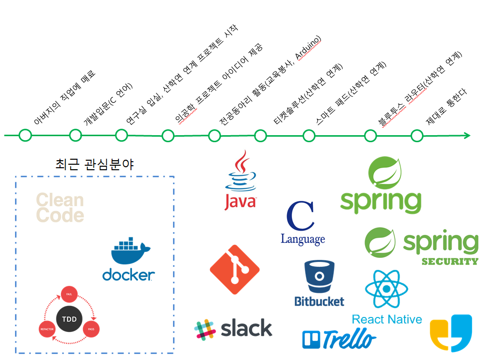

## 송승효

* Email: tmdgy15@gmail.com
* GitHub: https://github.com/Songseunghyo1  

 

## ABOUT ME

[**모두에게 필요한 물처럼!!**]

어릴적 아버지를 따라서 아버지의 사무실에 놀러간 적이 있습니다.  개발자이신 아버지께서는 간단한 프로그램을 만들어 제게 보여주시며 '아버지는 이런 일을 한다'라고 하셨습니다. 그 모습에 저는 매료되어 개발자의 꿈을 키워왔습니다. 이에 전문지식을 습득하기 위해 특성화 고등학교에 진학하여 기초지식을 습득하였습니다. 그리고 학문적인 내용을 더 깊이있게 배우고자 제주대학교 컴퓨터공학과에 진학하였습니다. 

1학년 과정을 마친 뒤 군복무를 마치고 복학하며 학과에 있는 시스템 소프트웨어 연구실에 들어갔습니다. 연구실에서 지도교수님 그리고 학부생 연구원들과 연구활동을 진행하였습니다. 갓 복학하여 연구실에 들어갔을 때, 연구실에서는 의공학과 관련하여 프로젝트를 진행하고 있었습니다. 이 프로젝트는 신경외과와 함께 진행하는 프로젝트였는데, 척추수술이 필요한 환자의 CT사진을 이용하여 수술방법을 제안할 수 있는 프로그램을 제작하는 프로젝트였습니다. 비록 저는 이 프로그램을 개발하는데에 참여하지 못했지만 제가 제안한 방법을 적용하여 프로그램을 작성하여 너무 기뻤습니다. 이후, 서울에 위치한 회사와 '티켓 솔루션'이라는 이름으로 산학연 연계 프로젝트를 진행하였습니다. 그리고 지금은 제주도에 위치한 연구소와 산학연 연계프로젝트를 진행하고 있습니다.

저는 프로그램을 제작할 때 항상 사용자의 입장을 생각하도록 노력하고 있습니다. 사용자가 원하는 것, 필요한것을 만들어 사용자의 수고를 덜어주고 편의를 제공하는 것이 개발자의 역할이라고 생각합니다. 제가 참여한 프로젝트 중 '제대로 통한다'라는 버스 도착정보 애플리케이션 그리고 개발에는 참여하지 못하였지만 저의 아이디어를 적용한 의공학 프로젝트 모두 사용자에게 도움이 되는 프로그램입니다. 이처럼 저는 다른 사람들에게 유익한 프로그램을 제작하며 꼭 필요한 물이되고자 노력하고있습니다.

[**지식을 전달하는 기쁨**]

군복무를 마치고 복학하였을 때 **전공동아리**활동을 하였습니다. 저는 동아리의 장으로써 학과 후배들과 동아리를 꾸려 아두이노보드를 이용하여 스터디를 진행하였습니다. 그리고 스터디를 통해 습득한 지식을 제주도내에 위치한 중고등학교에 방문하여 교육봉사를 진행하였습니다.

처음에는 하드웨어를 처음 다뤄보는 터라 어려움이 있었습니다.  제가 알고있는 지식을 다른 사람에게 전달해야하기 때문에 기초부터 응용하여 아두이노보드와 센서를 구성할 수 있도록 스터디를 진행하였습니다. 처음 다루는 센서는 구글링을 통하여 사용 방법을 찾아보고 사용법을 응용하여 다른 센서와 연동시키며 학습하였습니다. 

그리고 교육봉사에 사용할 자료를 만들었습니다. 아두이노보드와 각 센서간의 연결도면에서 부터 시작하여 보드에 업로드할 소스코드까지 자료를 만들며, 어떻게 하면 중고등학생들이 쉽게 이해할 수 있을까? 라는 고민을 하며 만들다 보니 밤을 꼬박 지새운 적도 있었습니다. 이때, 저는 교수님께서 하셨던 말씀이 생각났습니다. '한 시간 수업을 위해 세 시간을 준비한다.'라는 말이 정말 공감되었습니다. 

저는 교육봉사를 하며 다른사람에게 지식을 전달하는 것이 처음이라 긴장되었습니다. 제가 전달하는 내용이 이해가 잘되는지 여러 번 물어보고 직접 돌아다니며 학생들의 작업 상태를 확인하고 뒤떨어지는 학생이 있으면 집중적으로 옆에서 도와주었습니다. 제가 방문하여 교육봉사를 진행한 학교의 학생들은 대부분 프로그래밍 경험이 없고, 하드웨어 역시 처음 다뤄보는 친구들이 많았습니다. 처음에는 가르치는데 힘들었지만, 마지막에는 정말 뿌듯하고 학생들에게 감사했습니다. 다른사람에게 지식을 전달하는 것이 처음인 저에게 지식을 전달받고 본인들이 습득한 지식을 이용하여 스스로 응용까지 해냈기 때문입니다. 저는 전공동아리 활동을 하면서 교육봉사를 통해 다른 사람에게 지식을 전달하는 것이 이렇게 뿌듯하다는 것을 느꼈습니다. 

[**소프트웨어와 하드웨어의 앙상블**]

전공동아리 활동을 하며 동아리 구성원들과 함께 두 개의 프로젝트를 진행하였습니다. 하나의 프로젝트는 대전에서 개최한 융합과학창작경진대회에 참가하며 만든 **지능형 냉장고**와 또다른 하나는 아두이노보드에 블루투스모듈을 탑재하여 스마트폰 애플리케이션으로 보드를 제어할 수 있는 **스마트 홈**입니다.

**지능형 냉장고**는 아두이노보드로 냉장고를 제어하도록 만들었습니다. 이 냉장고는 220v전원을 사용하도록 만들었으며, 에어컨에도 적용된 한쪽면을 뜨겁게 달구면 반대쪽면은 차가워지는 원리를 이용한 펠티어 소자를 이용하여 냉장고의 내부온도를 낮추도록 하였습니다. 그리고 사용자가 희망온도를 설정하여 냉장고의 내부온도를 조절할 수 있도록 제작하였습니다. 그리고 시중에서 판매하는 냉장고와 최대한 유사하게 만들기 위해 냉장고의 문이 마그네틱 센서를 이용하여 열린 시간을 체크하여 정해진 시간만큼 문이 열려있다면 부저를 이용해 경고음을 발생시키고 내부에 LED를 절치하여 문열림이 감지되면 점등되도록 하였습니다.  이 냉장고를 융합과학창작 경진대회에 가지고 나가 발표한 결과 장려상을 수상하였습니다.

**스마트 홈**은 아두이노보드에 블루투스 모듈을 연결하여 스마트폰으로 아두이노보드를 제어할 수 있도록 제작하였습니다. 모형 집에 안드로이드 폰으로 제어할 수 있는 아두이노보드와 블루투스 모듈을 탑재하고 모형 집의 각 방마다 LED전구를 달아 안드로이드폰과 블루통신을 통하여 점등 및 소등을 할 수 있도록 제작하였습니다. 그리고 모형집의 주방에는 상시전력으로 가스센서를 연결하여 가스가 검출될 경우 붉은색 LED전구가 깜빡이는 동시에 부저로부터 경고음을 울리도록 하였습니다. 그리고 가정의 보안을 위해 모형집의 창문에 조도센서와 레이저 모듈을 부착하여 조도센서로 향하는 레이저모듈의 빛이 끊어질 경우 부저를 울리도록 제작하였습니다.

스마트홈을 만들며 프로토타입을 우선적으로 제작하였으나 미리 코드를 정리하지 않아 정상적으로 동작하지 않았습니다. 그리하여 처음부터 다시 아두이노에 연결한 선을 확인하고 다시 조립 및 코드작성에 들어갔습니다. 가독성을 높이고 수정하기 편하도록 각 기능마다 함수화 시키며 코드를 작성하였습니다. 그리고 코드를 모두 인쇄하여 아두이노와 연결되어있는 모듈을 채크하며 정상적으로 동작하는지 확인하였습니다.

[**꿈을 향해 달리는 주니어 개발자**]

어릴적 아버지의 사무실에 놀러가서 아버지께서 만들어 보여주신 프로그램을 보고 아버지와 같은 길을 걷고싶다는 꿈을 가지고 특성화 고등학교에 입학하였습니다. 고등학교에 진학한 뒤, 로봇동아리 활동을 하며 제가 만든 작품을 학교 예술제에 전시하여 다른 학생들의 호응을 얻을 수 있었고, 제가 하고 싶은일에 저의 열정을 투자한 결과 수료식 날 교육감상인 컴퓨터 꿈나무 상을 수상하였습니다. 

대학에 진학한 뒤, 군대를 다녀와 학과 내의 시스템 소프트웨어 연구실에 입실하여 학부생 연구원으로 활동하였습니다. 연구실에서 학부생 연구원으로 활동하며 여러 프로젝트를 진행하였지만, 제가 연구실에 입실한 시기가 프로젝트의 마무리 단계여서 맞지 않아 개발에 참여하지 못한 프로젝트가 있습니다. 그 프로젝트는 의사에게 수술법을 제안해주는 프로그램을 제작하는 것입니다. 저는 아쉽게도 개발에 참여하지는 못하였지만, 척추수술이 필요한 환자에게 수술할 때  어떠한 각도로 수술용 볼트를 삽입할지 제안해주는 프로그램을 제작할 때 아이디어를 내어 저의 의견을 적용하여 제작하였습니다. 비록 이 프로젝트는 개발에 참여하지 못했지만 저의 의견이 반영되어 정말 기뻤습니다.

그 이후, 연구실에서 진행하는 산학연 연계프로젝트는 모두 개발에 참여하여 현재까지 진행 중입니다. 가정에서 기르는 반려동물의 운동량을 늘려주고 활동량을 체크할 수 있는 시스템, 그리고 방석과 흡사하게 생긴 하드웨어 장비위에 반려동물이 올라가 앉을 경우 반려동물의 체온, 심탄도 등을 서버에 저장하고 클라이언트에 요청에 따라 요청 수행 그리고 대중교통을 이용하여 통학하는 학우를 위한 제대로통한다 프로젝트 이 모든 것이  사용자의 편의를 제공하기 위해 진행한 프로젝트입니다. 저의 꿈은 그냥 개발자가 아닌 사용자에게 편의를 줄 수 있는 프로그램을 개발하는 **모두에게 필요한 물**같은 개발자입니다. 앞으로 많은 프로그램을 만들고, 사용자에게 서비스를 제공하게 될 것입니다. 저는 항상 저의 서비스를 사용하는 사용자의 입장에서 개발을 하려 노력중인 주니어 개발자입니다.

## SKILLS 

* **Language**
  * Java(Main)
  * C
* **Frameworks**
  * Spring Framework, Spring Security
* **Database**
  * MySQL, MariaDB, Workbench
* **Etc**
  * Linux
  * GitHub, GitLab, Bitbucket
  * Trello
  * Slack
  * Arduino  

 

## PROJECT [Detail](#projectdetail)

* **제대로 통한다 관리자페이지** 

  * **주요기능**
    * 제주대학교에서 출발하는 시내버스와 셔틀버스의 시간표를 실시간 제공
    * 비인가자 접근 방지를 위한 로그인기능
    * 데이터베이스 명령문을 모르는 사람도 데이터를 변경 가능하도록 수정(개발중)
  * **개발기간** 
    *  2018.03 ~ 2018.06
  * **개발환경**
    * Linux
    * InteliJ
  * **사용언어 및 기술**
    * Java
    * Spring Framework, Spring Security
    * Thymeleaf
  * Database
    * MariaDB  

   

## LAB [Detail](#projectdetail)

#### 산학연 연계 프로젝트

* **Bluetooth Router**
  * 주요기능
    * 블루투스 통신을 이용하여 가정에서 기르는 반려동물의 활동량 증가
    * 중계기와 반려동물의 목걸이간의 통신을 통해 활동량 체크
  * 개발기간
    * 2017.09 ~
  * 개발환경
    * Win10
    * Android Studio
  * 사용언어 및 기술
    * Android
    * Android BLE  

 

* **Ticket Solution** 
  * 주요기능
    * 하나의 앱으로 여러 온라인 쇼핑몰의 상품상태 확인(재고, 판매수량 등)
  * 개발기간
    * 2017.07 ~ 2018.06
  * 사용언어 및 기술
    * React Native  

 

* **Smart Pad**
  * 주요기능
    * 하드웨어 장비위에 반려동물이 앉을 경우 체온, 심탄도 등을 측정하여 서버에 저장
    * 사용자의 요청에따라 어떠한 요청인지 파싱하여 서버에 저장된 데이터 제공
  * 개발기간
    * 2017.03 ~
  * 개발환경
    * Win10
    * Visual Studio
  * 사용언어 및 기술
    * C  

 

## INTEREST

## <a id="projectdetail">Project Detail

**제대로 통한다**

현재 제주도는 대중교통 활성화를 위해 버스전용차로를 만들고 버스시스템이 크게 개편되었습니다. 그리고 플레이스토어 혹은 앱스토어에 출시된 어플리케이션은 기사님이 어플리케이션을 실행시키지 않으면 정보를 얻을 수 없습니다. 그래서 이 불편함을 해소하고자 '직접 만들자!'라는 생각에 시작한 프로젝트입니다. 그리고 제주대학교는 캠퍼스가 넓어 교내에서 순환버스를 운행하는데, 이 순환버스를 이용하는 학우가 많습니다.  이 애플리케이션을 사용중인 사용자에게 시내버스와 아울러 교내순환버스의 도착정보를 함께 제공하여 편의성을 제공하기 위해 제작하였습니다.

저는 이 프로젝트를 진행하며 관리자페이지 제작을 맡았습니다. 관리자 페이지를 제작하게 된 동기는 평일과 공휴일 그리고 방학 중 모두 버스노선과 도착정보가 상이하고, 새로 바뀔 수 있는 버스 노선 정보를 데이터베이스의 명령문을 알지 못하는 사람도 변경할 수 있도록 하기 위함입니다. 

관리자 페이지를 만들며 Spring Security를 사용하여 로그인 기능을 제작하였고, Thymeleaf를 이용하여 데이터베이스로부터 정보를 가져와 웹 페이지에 출력하였습니다.

**Bluetooth Router**

이 프로젝트는 비콘과 블루투스 라우터(중계기), 반려동물의 목걸이 그리고 반려동물의 장난감 공간의 블루투스 통신을 이용하여 반려동물의 목걸이가 장난감 공에 가까이 다가가면 장난감 공은 목걸이로부터 멀어지며 반려동물의 운동량을 늘려주고 반려동물의 활동량을 웹 서버를 통해 확인할 수 있는 시스템을 개발하는 것입니다. 

저는 이 프로젝트를 진행하며 스마트폰과 비콘간의 통신을 위한 저전력 블루투스 애플리케이션 개발과 아울러 프로토콜을 디자인하는 역할을 맡았습니다. 

**Ticket Solution**

온라인 쇼핑몰에서 상품을 판매하는 판매자는 여러 쇼핑몰에 상품을 등록합니다. 그러나 쇼핑몰 각각의 업로드 프로그램을 사용하기 때문에 상품 판매자는 본인이 판매중인 상품의 대한 상태를 파악하기 번거롭습니다. 

저희는 무형상품(온라인 티켓 등)을 판매하는 판매자를 대상으로 상품을 업로드 할 때 번거롭게 쇼핑몰마다 다른 업로드 프로그램을 사용하지 않고 하나의 프로그램으로 업로드 할 수 있으며, 상품의 상태(상품재고, 상품 사용여부, 사용처리 등)을 한눈에 파악할 수 있는 웹 페이지와 무형티켓 구매자가 사용현장에서 티켓을 사용할 경우 판매자가 해당 티켓에 대한 사용처리그리고 상품의 상태를 확인 가능한 모바일 애플리케이션을 제작하기로 결정을 하였습니다. 

저는 이 프로젝트를 진행하며 React Native를 이용하여 안드로이드와 IOS 모바일 애플리케이션의 프론트-앤드를 맡아 개발하였습니다. 

**Smart Pad**

스마트 패드는 원형의 방석과 흡사하게 생긴 하드웨어 장비로 동물병원에 입원한 반려견의 상태를 확인할 수 있는 장비입니다. 스마트 패드위에 반려견이 올라가 앉으면 반려견의 체온, 심탄도 등을 서버로 전송하고 클라이언트가 서버에게 데이터를 요청하면 해당하는 데이터를 제공하는 반려견의 건강정보제공 시스템입니다. 

저는 이 프로젝트를 진행하며 C언어를 이용해 TCP/IP통신을 사용하여 서버를 테스트하는 코드를 작성해보았습니다.  

 

## EDUCATIONS

**제주대학교** 2013.03 ~ 2019.02(졸업예정)

* **컴퓨터공학과**
  *   Kakao Track 참여
    * 포털서비스개발방법론
      * 객체지향과 아울러 디자인패턴을 배울 수 있었고, 리팩토링도 함께 진행하였습니다.
* **시스템 소프트웨어 연구실**
  * 산학연연계프로젝트 참여  

 

## EXPERIENCE
#### 논문발표
* International Conference Computing Convergence and Applications(ICCCA 2017, 2017.08.17~20)  

 

#### 전공동아리 

* 교육봉사(2016.6 ~ 2016.12)

* 융합과학창작경진대회(2016.8)
* 2016학년도 특성화분야 전공동아리 & 인하대 교류 성과발표회(2016.12)  

 

## AWARD
* **BEST PAPER AWARD**(ICCCA 2017, 2017.08.17~20)
  * International Conference Computing Convergence and Applications
  * 한국컴퓨터정보학회  

* **공과대학장상-최우수동아리**(제주대학교 전공동아리<We can do it!>, 2016.12.19)
  * 2016학년도 특성화분야 전공동아리 & 인하대 교류 성과발표회
  * 제주대학교 스마트그리드와 청정에너지 융복합산업 인력양성사업단